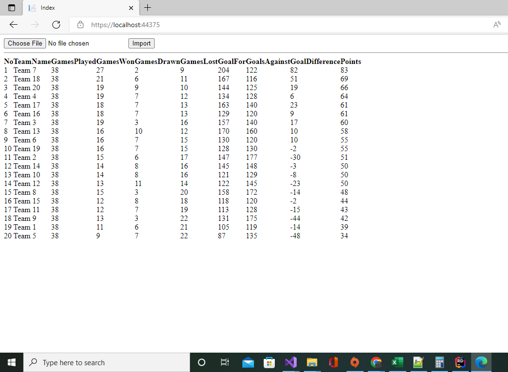
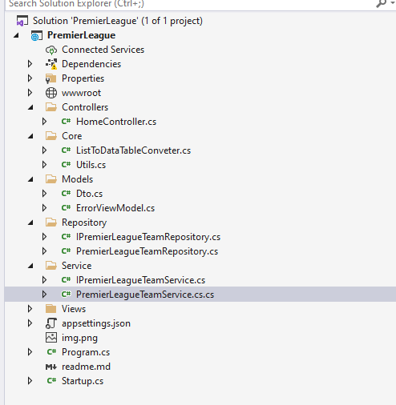

Premier League Teams ranking
----


I have created a simple MVC application to be able to display Premier soccer league ranking, Kinly never mind the UI , i mean the look an feel of the UI i have invested time on the functionality rather than the look and feel. Please see how the final functionality looks as depicted below.



To come up with a fully functional application i had to follow a little bit of SOLID principle and i made use repository pattern thought there's no much data separation or data mapping i had to implement it to show understanding on it.


Below is the structure of the application, Unfortunate i don't have Enterprise Architecture on my PC i was gonna create the architecture of this application. 



All logic is seating in the service i tried to separate the business logic from the Main controller, i'm using (Constructor)Dependency Injection to reference my services and my repository.
```
 [HttpPost]
        public IActionResult Index(IFormFile postedFile)
        {
            int counter = 1;
            string path = Path.Combine(this.Environment.WebRootPath, "Uploads");
            var stringJsonArray  = iPremierLeagueTeamService.GetJsonConvertedFromCsv(Utils.getPath(path, postedFile));

            var PremierLeagueLogTable = iPremierLeagueTeamService.PreparingLogTableData(stringJsonArray);
            var SortedPremierLeagueLogTable = iPremierLeagueTeamService.TeamsSortedByHighestPoints(PremierLeagueLogTable);
            var teamRanked = iPremierLeagueTeamService.TeamsRanking(SortedPremierLeagueLogTable, counter);

             DataTable dataTable= ListtoDataTableConverter.ToDataTable(teamRanked);           
            return View(dataTable);
        }
  ```        

The Main Logic is converting csv into Json so that i can be able to easily manipulate the data , is depicted in the bellow code snipped, 

``` 
 public List<Dto> PreparingLogTableData(string jsonstring)
        {
            try
            {
                JArray jArray = JArray.Parse(jsonstring);
                List<Dto> listDto = new List<Dto>();
                foreach (var team in jArray)
                {
                    Dto dtoObject = new Dto();
                    foreach (var rounds in team)
                    {
                        var teamRound = rounds.First().ToString();

                        if (teamRound.Contains("-"))
                        {
                            var scoreSeparator = teamRound.IndexOf('-');
                            var homeTeamScore = int.Parse(teamRound.Substring(0, scoreSeparator));
                            var otherTeam = int.Parse(teamRound.Substring(scoreSeparator + 1));

                            if (homeTeamScore > otherTeam)
                            {
                                dtoObject.Points += 3;
                                dtoObject.GamesWon += 1;

                            }
                            else if (homeTeamScore < otherTeam)
                            {
                                dtoObject.Points += 0;
                                dtoObject.GamesLost += 1;
                            }
                            else
                            {
                                dtoObject.Points += 1;
                                dtoObject.GamesDrawn += 1;
                            }
                            dtoObject.GamesPlayed += 1;
                            dtoObject.GoalFor += homeTeamScore;
                            dtoObject.GoalsAgainst += otherTeam;
                            dtoObject.GoalDifference = dtoObject.GoalFor - dtoObject.GoalsAgainst;
                        }
                        else
                        {
                            dtoObject.TeamName = rounds.First().ToString();
                        }

                    }
                    listDto.Add(dtoObject);

                }
                return listDto;

            }
            catch (Exception ex)
            {

                throw;
            }
  
        }
  ```

<br />
i wish i can document the whole project but i have to jump on to some other work, Thanks this was a bit challenging.


##Thank You!!!.